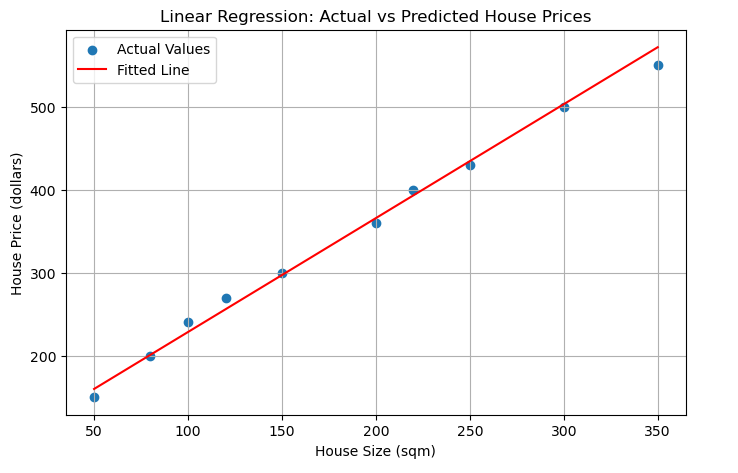

# Linear Regression House Price Prediction (ML)

This project demonstrates a simple **machine learning regression pipeline** using **Linear Regression** to predict house prices based on property size.

The goal is to show how a continuous target variable (house price) can be modeled using a single numerical feature (house size), while following a clear and reproducible ML workflow.

---

## 📌 Business Context

A fictional company, **RealEstateCo**, wants to estimate house prices based on the size of properties (in square meters).  
Using historical sales data, a linear regression model is trained to learn the relationship between house size and price.

This type of model can assist:
- Property valuation teams
- Real estate analysts
- Automated pricing tools

---

## 📊 Dataset Overview

The dataset consists of:
- **House Size (sqm)** – numerical feature  
- **House Price ($1000)** – continuous target variable  

The data is small and synthetic, making it ideal for demonstrating the fundamentals of regression modeling.

---

## 🧠 Machine Learning Approach

The following steps were implemented:

1. Data creation using structured tabular format  
2. Train–test split to evaluate generalization  
3. Training a **Linear Regression** model  
4. Model evaluation using **Mean Squared Error (MSE)**  
5. Visualization of actual data points vs the fitted regression line  

---

## 📈 Model Output: Actual vs Predicted Prices

The plot below shows how well the trained regression model fits the observed data.

- **Blue dots** represent actual house prices  
- **Red line** represents the model’s predicted values  

This visualization confirms a strong linear relationship between house size and price.

---

## 👤 Author

**Muhammed Uwais Adam**  
Machine Learning | Data Analysis | Applied Python
